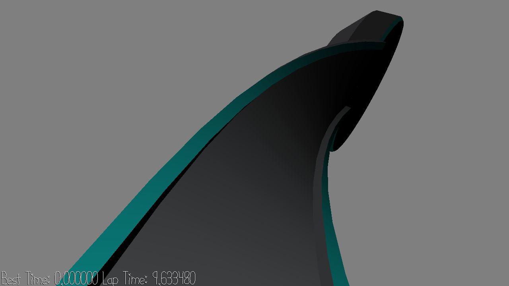

# Go Kart

Bug Note:

Possible unresolved bug in the scene. Using racetrack.blend to generate the necessary dist files results in errors while running the game. I'm not sure if this is because of the blender file itself or just my system, as I also had errors when generating dist files using the default phone-bank.blend. These errors were not present when using the default phone-bank dist files.

The current racetrack files in dist are the default phone-bank files from the base repo. The actual racetrack can be found in scenes/racetrack.blend. I've also attached an image of it as screenshot2.png.

Author: Jonathan Yan

Design: Drive around and aim for the fastest lap on this racetrack full of twists and turns.

Screen Shot:

How To Play:

Press w to accelerate, s or space for the brake, and shift to boost. Movement is momentum-based, so take care when turning!

Sources:
Most 3D models: https://free3d.com/3d-model/low-poly-models-pack-1-51302.html
Scene layout modified by myself

This game was built with [NEST](NEST.md).

